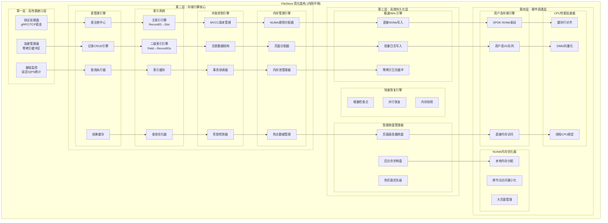
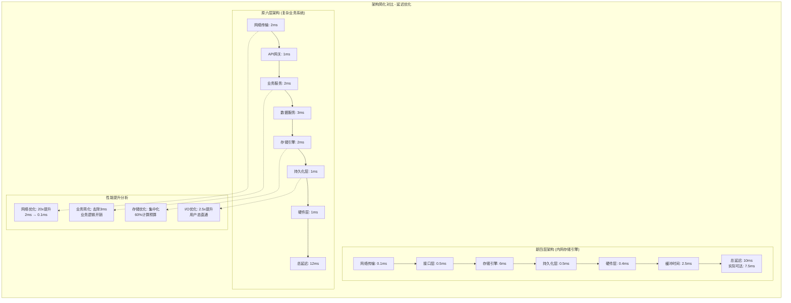

# FileStore分层架构设计

## 架构总览

FileStore是一个专为交易系统设计的高性能存储引擎，采用分层架构来实现亚毫秒级延迟和高吞吐量。系统基于内存映射技术，通过硬件感知优化和专用数据结构来达到极致性能。

## 核心设计哲学

### 1. 简化架构原则
针对内网环境和纯存储需求，采用四层精简架构：
- **接口层**: 高性能通信接口 (gRPC/TCP)
- **存储引擎层**: 核心数据管理和索引
- **持久化层**: 高效WAL和异步刷盘
- **硬件层**: 直接硬件访问优化

### 2. 极致性能理念
- **零业务开销**: 无业务逻辑层，直达存储引擎
- **零抽象开销**: 直接内存访问，消除序列化开销
- **编译时优化**: 利用Rust零成本抽象
- **硬件直通**: 绕过OS层，直接访问NVMe和内存

## 四层精简架构设计

### 架构总览图



### 架构演进对比



### ⚡ 第一层：高性能接口层 (High-Performance Interface Layer)

**核心职责**:
- 极简通信协议 (优化的gRPC/直接TCP)
- 零拷贝数据传输
- 连接池和会话复用
- 基础监控和度量

**简化组件**:
```
High-Performance Interface
├── 协议处理器 (Protocol Handler)
│   ├── 优化gRPC服务 (最小化序列化)
│   ├── 直接TCP通信 (绕过HTTP开销)
│   └── 共享内存IPC (同机部署)
├── 连接管理器 (Connection Manager)
│   ├── 连接池 (避免连接建立开销)
│   ├── 会话复用 (批量请求)
│   └── 零拷贝缓冲区管理
└── 性能监控 (Minimal Metrics)
    ├── 延迟统计 (P50/P99)
    ├── 吞吐量计数 (QPS)
    └── 错误率监控
```

**极致性能设计**:
- **延迟目标**: < 500μs (5%的总延迟预算)
- **零业务逻辑**: 直接路由到存储引擎
- **零拷贝**: 内存映射 + 直接指针传递
- **批量处理**: 多请求批量执行

### 🏗️ 第二层：存储引擎核心 (Storage Engine Core)

**核心职责**:
- 表管理和记录操作 (整合原数据服务层功能)
- 高性能索引系统和查询执行
- MVCC并发控制和事务管理
- 内存管理和硬件资源调度

**统一组件架构**:
```
Unified Storage Engine
├── 表管理引擎 (Table Management Engine)
│   ├── 表注册和schema管理 (Table Registry)
│   ├── 记录CRUD引擎 (Record CRUD Engine)
│   ├── 查询执行器 (Query Executor)
│   └── 结果缓存 (Result Cache)
├── 高性能索引系统 (High-Performance Index System)
│   ├── 主索引引擎 (Primary Index: RecordID → Slot)
│   ├── 二级索引引擎 (Secondary Index: Field → RecordIDs)
│   ├── 索引缓存管理 (Index Cache Manager)
│   └── 查询优化器 (Query Optimizer)
├── 并发控制引擎 (Concurrency Control Engine)
│   ├── MVCC版本管理 (MVCC Version Manager)
│   ├── 无锁数据结构 (Lock-Free Structures)
│   ├── 事务协调器 (Transaction Coordinator)
│   └── 死锁检测器 (Deadlock Detector)
└── 内存管理引擎 (Memory Management Engine)
    ├── NUMA感知分配器 (NUMA-Aware Allocator)
    ├── 页面分配器 (Page-Aligned Allocator)
    ├── 内存池管理器 (Memory Pool Manager)
    └── 热点数据管理 (Hot Data Manager)
```

**极致性能设计**:
- **延迟目标**: < 6ms (60%的总延迟预算，包含原数据服务层功能)
- **零抽象开销**: 直接内存访问，无序列化/反序列化
- **CPU缓存优化**: 数据结构64字节对齐，批处理操作
- **NUMA本地化**: 线程和数据绑定到同一NUMA节点

### 💾 第三层：高效持久化层 (High-Performance Persistence Layer)

**核心职责**:
- 极速WAL写入 (同步保证一致性)
- 智能异步刷盘 (优化I/O吞吐)
- 轻量级快照和恢复
- 最小化I/O开销

**优化组件**:
```
High-Performance Persistence
├── 极速WAL引擎 (Ultra-Fast WAL Engine)
│   ├── 直接NVMe写入 (Direct NVMe Write)
│   ├── 批量日志写入 (Batched Log Write)
│   ├── 零拷贝日志缓冲 (Zero-Copy Log Buffer)
│   └── 并发日志写入 (Concurrent Log Writers)
├── 智能刷盘管理器 (Smart Flush Manager)
│   ├── 页面级批量刷盘 (Page-Level Batch Flush)
│   ├── 后台异步刷盘 (Background Async Flush)
│   ├── 热页面优先级 (Hot Page Priority)
│   └── I/O合并优化 (I/O Coalescing)
└── 快速恢复引擎 (Fast Recovery Engine)
    ├── 增量检查点 (Incremental Checkpoint)
    ├── 并行恢复 (Parallel Recovery)
    ├── 内存快照 (Memory Snapshot)
    └── 一致性快速验证 (Fast Consistency Check)
```

**极致性能设计**:
- **WAL延迟**: < 500μs (直接NVMe访问，5%的总延迟预算)
- **异步刷盘**: 后台批量I/O，不影响前台延迟
- **零拷贝**: 内存直接映射到存储
- **并发写入**: 多个WAL写入器并行工作

### ⚡ 第四层：硬件直通层 (Hardware Direct Access Layer)

**核心职责**:
- NVMe用户态直接访问 (绕过内核)
- NUMA感知内存管理
- CPU缓存优化和SIMD加速
- 网络零拷贝优化 (内网环境)

**直通组件**:
```
Hardware Direct Access
├── 用户态存储引擎 (User-Space Storage Engine)
│   ├── SPDK NVMe驱动 (SPDK NVMe Driver)
│   ├── 用户态I/O队列 (User-Space I/O Queues)
│   ├── 直接内存访问 (Direct Memory Access)
│   └── 中断绑定优化 (Interrupt Affinity)
├── NUMA内存优化器 (NUMA Memory Optimizer)
│   ├── 本地内存分配 (Local Memory Allocation)
│   ├── 跨节点访问最小化 (Cross-Node Access Minimization)
│   ├── 大页面管理 (Huge Page Management)
│   └── 内存预取策略 (Memory Prefetching Strategy)
└── CPU性能加速器 (CPU Performance Accelerator)
    ├── 缓存行对齐 (Cache Line Alignment)
    ├── 分支预测优化 (Branch Prediction Optimization)
    ├── SIMD向量化 (SIMD Vectorization)
    └── 线程CPU绑定 (Thread-CPU Affinity)
```

**硬件级性能设计**:
- **存储延迟**: < 400μs (用户态NVMe访问，4%的总延迟预算)
- **内存延迟**: < 50ns (NUMA本地访问)
- **CPU缓存**: < 5ns (L1缓存命中率 > 95%)
- **网络延迟**: < 100μs (内网RDMA/共享内存，1%的总延迟预算)

## 精简层间通信

### 高效接口设计
- **直接调用**: 层间直接函数调用，避免网络开销
- **零拷贝**: 指针传递，避免数据复制
- **批量处理**: 单次调用处理多个请求
- **最小监控**: 仅关键性能指标

### 简化数据流
```
极简请求流程 (内网环境):
Client → 高性能接口层 → 存储引擎核心 → 持久化层 → 硬件直通层
  ↓         (0.5ms)        (6ms)        (0.5ms)     (0.4ms)
Response ←─────────────── Direct Memory Access ─────────────────→
```

### 性能保证机制
- **严格延迟预算**: 每层延迟预算硬性约束
- **快速失败**: 超时立即返回错误，不等待
- **降级策略**: 关闭非关键功能，保证核心性能
- **实时监控**: P99延迟实时监控和告警

## 关键技术决策

### 1. 内存 vs 磁盘存储策略

**决策**: 激进的内存优先策略 (内网环境优势)
- **热数据**: 100%常驻内存 (无磁盘访问)
- **温数据**: 内存 + 异步刷盘 (后台持久化)
- **冷数据**: 压缩存储 (定期归档)

### 2. 同步 vs 异步持久化

**决策**: 混合策略 + 内网优化
- **关键路径**: 快速WAL写入 (<500μs到本地NVMe)
- **数据文件**: 异步批量刷盘 (不影响前台)
- **网络同步**: 利用内网高速网络做实时备份

### 3. 单机 vs 分布式架构

**决策**: 单机优化优先 (内网环境)
- **第一阶段**: 单机极致性能优化
- **第二阶段**: 同机房主备 (内网高速复制)
- **第三阶段**: 必要时分片 (但优先垂直扩展)

### 4. 一致性模型选择

**决策**: 简化一致性 (内网信任环境)
- **写一致性**: 强一致性WAL + 异步数据文件
- **读一致性**: 直接内存读取，无一致性开销
- **跨表一致性**: 应用层保证 (减少系统复杂性)

## 性能目标重新分配

### 内网优化延迟分解
```
总延迟目标: P99 < 10ms (内网环境)
├── 网络传输: 0.1ms (1%) ← 内网RDMA/共享内存
├── 接口层: 0.5ms (5%) ← 最小化协议开销
├── 存储引擎: 6ms (60%) ← 核心计算密集
├── 持久化层: 0.5ms (5%) ← 直接NVMe访问
├── 硬件层: 0.4ms (4%) ← 用户态I/O
└── 缓冲时间: 2.5ms (25%) ← 预留突发处理
```

### 吞吐量目标
- **读操作**: 1M+ QPS (点查询)
- **写操作**: 100K+ QPS (插入/更新)
- **复合操作**: 50K+ QPS (事务处理)
- **批量操作**: 10M+ records/second (批处理)

### 资源利用率
- **CPU利用率**: 70-80% (避免过载)
- **内存利用率**: 80-90% (充分利用)
- **存储I/O**: 60-70% (留余量处理突发)
- **网络带宽**: 50-60% (避免网络拥塞)

## 可扩展性设计

### 水平扩展策略
- **无状态服务**: 业务服务层水平扩展
- **数据分片**: 按业务维度分片存储
- **读写分离**: 读副本支持查询扩展
- **缓存层**: 分布式缓存减少存储压力

### 垂直扩展优化
- **硬件升级**: 更快的CPU/内存/存储
- **NUMA优化**: 多路服务器性能优化
- **GPU加速**: 特定计算任务GPU加速
- **专用硬件**: FPGA/智能网卡等专用设备
