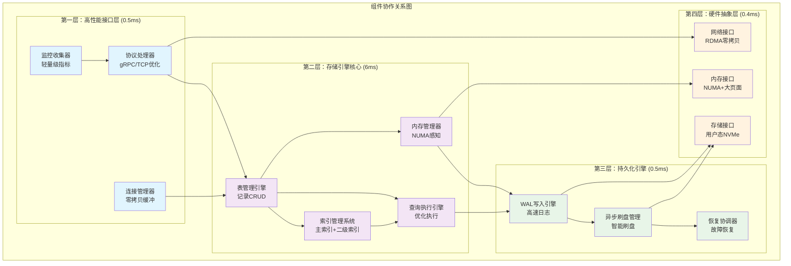

# 核心组件详细设计

## 设计总览

本文档详细设计FileStore存储引擎的核心组件架构，基于四层精简架构和10ms延迟目标，专门针对内网环境优化。

## 核心设计理念

### 系统设计原则
- **简化至上**: 去除不必要的抽象层，直达核心功能
- **性能导向**: 每个组件都以延迟和吞吐量为首要考虑
- **内网优化**: 充分利用内网高速、可信、低延迟特性
- **硬件感知**: 针对现代多核、NUMA、NVMe架构优化

### 架构设计目标
- **延迟控制**: P99 < 10ms，平均延迟 < 3ms
- **吞吐量**: 读 > 1M QPS，写 > 100K QPS
- **可用性**: 99.9%+ 系统可用性
- **扩展性**: 支持单机到小型集群的平滑扩展

## 组件设计总体方案

### 设计层次结构
```
第一层：高性能接口层 (延迟预算: 0.5ms)
├── 协议处理器：负责请求解析和响应生成
├── 连接管理器：管理客户端连接和会话
└── 监控收集器：轻量级性能指标收集

第二层：存储引擎核心 (延迟预算: 6ms)
├── 表管理引擎：表的生命周期和记录管理
├── 索引管理系统：主索引和二级索引管理
├── 查询执行引擎：查询优化和执行
└── 内存管理器：NUMA感知的内存分配

第三层：持久化引擎 (延迟预算: 0.5ms)
├── WAL写入引擎：高速事务日志处理
├── 异步刷盘管理：后台数据持久化
└── 恢复协调器：故障恢复和一致性保证

第四层：硬件抽象层 (延迟预算: 0.4ms)
├── 存储接口：NVMe用户态访问
├── 内存接口：NUMA和大页面管理
└── 网络接口：RDMA和零拷贝优化
```

## 第一层：高性能接口层组件设计

### 1.1 协议处理器设计 (Protocol Handler)

**设计目标**: 延迟预算 0.5ms，支持 100K+ QPS

#### 协议选择策略
**多协议支持架构**:
- **gRPC优化协议**: 主要协议，针对性能优化
  - 预编译协议定义，减少运行时开销
  - 零拷贝缓冲区管理
  - 批量请求支持

- **直接TCP协议**: 极简二进制协议
  - 自定义二进制格式，最小序列化开销
  - 固定长度头部设计
  - 流水线请求处理

- **共享内存IPC**: 同机部署优化
  - 进程间零拷贝通信
  - 环形缓冲区设计
  - 信号量同步机制

#### 请求处理流水线设计
**四阶段处理架构**:
```
请求处理流水线:
输入请求 → 解析阶段 → 验证阶段 → 路由阶段 → 响应阶段
   (原始数据) → (100μs) → (50μs) → (50μs) → (100μs)
   
阶段1 - 零拷贝解析:
├── 直接内存视图构建
├── 避免数据复制
└── 指针操作优化

阶段2 - 最小验证:
├── 基础格式检查
├── 权限验证（内网简化）
└── 请求完整性确认

阶段3 - 智能路由:
├── 表名快速查找
├── 负载感知路由
└── 连接复用

阶段4 - 零拷贝响应:
├── 直接结果序列化
├── 内存视图返回
└── 批量响应优化
```

#### 性能优化策略
**内存管理优化**:
- 预分配缓冲区池，避免动态分配
- 页面对齐的内存布局
- NUMA感知的内存分配

**批处理优化**:
- 请求批量解析和处理
- 响应批量序列化
- 网络I/O批量提交

**缓存策略**:
- 协议解析结果缓存
- 路由信息缓存
- 连接状态缓存

### 1.2 连接管理器设计 (Connection Manager)

#### 连接池架构设计
**分层连接管理**:
```
连接管理层次:
客户端连接 → 连接池 → 会话管理 → 缓冲区管理
     ↓           ↓         ↓          ↓
   TCP连接    预建立连接   批量会话   零拷贝缓冲
```

**核心设计特性**:
- **预建立连接池**: 避免连接建立延迟
- **连接复用**: 最大化连接利用率
- **会话管理**: 支持批量请求处理
- **自适应调整**: 根据负载动态调整池大小

#### 零拷贝缓冲区管理
**内存池架构**:
```
缓冲区管理层次:
应用缓冲区 → 内存池 → 页面分配器 → 物理内存
     ↓          ↓         ↓           ↓
   逻辑视图   预分配池   页面对齐    NUMA本地
```

**优化策略**:
- **预分配内存池**: 避免运行时分配开销
- **页面对齐**: 优化CPU缓存性能
- **大页面支持**: 减少TLB缺失
- **NUMA感知**: 本地内存访问优化

#### 批量处理机制
**批量操作设计**:
- **请求聚合**: 将多个小请求合并处理
- **响应批量**: 批量返回结果减少网络开销
- **流水线处理**: 重叠I/O和计算操作

### 1.3 监控收集器设计 (Minimal Metrics)

#### 轻量级监控架构
**最小开销监控原则**:
- 只监控关键性能指标
- 使用无锁数据结构
- 异步数据收集
- 采样统计减少开销

**核心监控指标**:
```
性能指标体系:
├── 延迟统计
│   ├── P50延迟 (中位数)
│   ├── P99延迟 (尾部延迟)
│   └── 平均延迟
├── 吞吐量统计
│   ├── QPS (每秒查询数)
│   ├── TPS (每秒事务数)
│   └── 带宽利用率
└── 错误统计
    ├── 错误率
    ├── 超时率
    └── 连接失败率
```

## 第二层：存储引擎核心组件设计

### 2.1 表管理引擎设计 (Table Management Engine)

**设计目标**: 延迟预算 6ms，承担60%计算负载

#### 表注册中心架构
**快速表查找设计**:
```
表注册架构:
表名字符串 → 哈希映射 → 表ID → 表实例指针
     ↓          ↓        ↓        ↓
   字符串键   O(1)查找   数字ID   直接访问
```

**设计特性**:
- **双重索引**: 支持按名称和ID快速查找
- **类型安全**: 编译时类型检查
- **热加载**: 支持运行时表结构变更
- **统计集成**: 实时表级性能统计

#### 记录管理架构
**固定大小槽位设计**:
```
记录存储布局:
表头信息 → 分配位图 → 记录槽位区域 → 索引区域
   ↓         ↓          ↓           ↓
 元数据    槽位状态   固定大小槽   快速索引
```

**核心特性**:
- **固定槽位**: 消除内存碎片，O(1)地址计算
- **位图分配**: 快速槽位分配和回收
- **页面对齐**: 记录按页面边界对齐
- **预分配**: 避免运行时内存分配

#### 高性能CRUD操作设计
**操作流水线架构**:
```
CRUD操作流程:
请求 → 槽位分配 → 数据写入 → 索引更新 → 统计更新
  ↓       ↓         ↓         ↓         ↓
解析    位图操作   内存拷贝   索引插入   计数器
```

**性能优化策略**:
- **批量操作**: 批量处理多个记录
- **向量化**: 使用SIMD指令加速
- **预取优化**: 智能内存预取
- **并行处理**: 多线程并行执行

### 2.2 索引管理系统设计 (Index Management System)

#### 主索引架构设计
**RecordID到SlotIndex映射**:
```
主索引结构:
RecordID(64bit) → 哈希函数 → 桶位置 → SlotIndex
       ↓            ↓          ↓         ↓
   Snowflake格式   一致性哈希   哈希桶   槽位位置
```

**设计特性**:
- **哈希索引**: O(1)查找性能
- **Snowflake ID**: 全局唯一、时间排序
- **冲突解决**: 链式冲突解决
- **内存常驻**: 索引完全在内存中

#### 二级索引架构
**字段值到RecordID集合映射**:
```
二级索引类型:
├── 哈希索引 (等值查询)
│   ├── 字段值 → RecordID列表
│   └── O(1)查找性能
├── B+树索引 (范围查询)
│   ├── 有序字段值 → RecordID列表
│   └── O(log n)查找性能
└── 组合索引 (多字段查询)
    ├── 组合键 → RecordID列表
    └── 复杂查询优化
```

**索引优化策略**:
- **索引选择**: 智能索引选择算法
- **索引压缩**: 减少内存占用
- **增量更新**: 避免全量重建
- **并发访问**: 读写锁优化

### 2.3 查询执行引擎设计 (Query Executor)

#### 查询处理流水线
**五阶段查询处理**:
```
查询处理流程:
查询解析 → 查询优化 → 执行计划 → 并行执行 → 结果汇聚
   ↓         ↓         ↓         ↓         ↓
 语法分析   成本估算   操作序列   并发处理   结果组装
```

**优化策略**:
- **计划缓存**: 缓存常用查询的执行计划
- **统计驱动**: 基于统计信息的查询优化
- **并行执行**: 多线程并行查询处理
- **结果缓存**: 查询结果智能缓存

#### 特化查询优化
**针对内网环境的查询优化**:
- **点查询快速路径**: 绕过通用查询引擎
- **批量查询**: 批量处理相似查询
- **预编译查询**: 预编译常用查询模式
- **索引提示**: 显式索引选择

### 2.4 内存管理器设计 (Memory Manager)

#### NUMA感知内存分配
**分层内存管理**:
```
内存管理层次:
应用请求 → NUMA分配器 → 页面分配器 → 系统内存
    ↓         ↓           ↓           ↓
  内存需求   本地节点    页面对齐     物理内存
```

**优化策略**:
- **本地分配**: 优先从本地NUMA节点分配
- **大页面**: 使用2MB大页面减少TLB压力
- **预分配**: 启动时预分配大块内存
- **碎片整理**: 定期内存碎片整理

## 第三层：持久化引擎组件设计

### 3.1 WAL写入引擎设计 (WAL Engine)

**设计目标**: 延迟预算 0.5ms

#### 高速WAL架构
**WAL写入流水线**:
```
WAL写入流程:
事务提交 → 日志构建 → 批量写入 → 刷盘确认
    ↓         ↓         ↓         ↓
  事务数据   日志记录   用户态I/O   持久化确认
```

**性能优化**:
- **批量写入**: 聚合多个事务的日志记录
- **用户态I/O**: 使用SPDK绕过内核
- **并行写入**: 多个WAL写入器并行工作
- **压缩优化**: 实时日志压缩

### 3.2 异步刷盘管理设计 (Async Flush Manager)

#### 智能刷盘策略
**多层刷盘架构**:
```
刷盘管理层次:
热页面 → 刷盘队列 → 批量I/O → 存储设备
  ↓        ↓         ↓         ↓
脏页监控  优先级队列  合并I/O   NVMe设备
```

**优化策略**:
- **页面级刷盘**: 按页面批量刷盘
- **优先级调度**: 热页面优先刷盘
- **I/O合并**: 合并相邻页面的I/O操作
- **后台处理**: 不影响前台业务处理

### 3.3 恢复协调器设计 (Recovery Coordinator)

#### 快速恢复机制
**恢复流程设计**:
```
恢复处理流程:
故障检测 → 状态分析 → 数据修复 → 一致性验证
   ↓         ↓         ↓         ↓
异常识别   损坏评估   WAL回放   完整性检查
```

**恢复优化**:
- **增量恢复**: 只恢复必要的数据
- **并行恢复**: 多线程并行数据修复
- **检查点**: 定期创建恢复检查点
- **快速验证**: 高效的一致性检查

## 第四层：硬件抽象层组件设计

### 4.1 存储接口设计 (Storage Interface)

#### 用户态NVMe访问
**直接设备访问架构**:
```
存储访问路径:
应用请求 → SPDK驱动 → NVMe队列 → 存储设备
   ↓         ↓         ↓         ↓
 I/O请求   用户态驱动  硬件队列   NVMe SSD
```

**性能特性**:
- **绕过内核**: 用户态直接设备访问
- **批量I/O**: 批量提交I/O请求
- **中断优化**: 中断绑定和轮询模式
- **队列管理**: 多队列并行I/O

### 4.2 内存接口设计 (Memory Interface)

#### NUMA优化内存管理
**内存拓扑感知**:
```
NUMA内存管理:
内存请求 → NUMA检测 → 本地分配 → 跨节点fallback
   ↓         ↓         ↓         ↓
分配需求   节点拓扑   本地内存   远程内存
```

**优化策略**:
- **拓扑感知**: 自动检测NUMA拓扑
- **本地优先**: 优先本地节点内存分配
- **大页面**: 透明大页面支持
- **预取优化**: 硬件预取优化

### 4.3 网络接口设计 (Network Interface)

#### 零拷贝网络优化
**网络处理优化**:
```
网络处理路径:
网络数据 → DMA缓冲 → 应用缓冲 → 处理逻辑
   ↓         ↓         ↓         ↓
数据包    零拷贝接收  内存视图   直接处理
```

**内网优化**:
- **RDMA支持**: 远程直接内存访问
- **SR-IOV**: 虚拟化环境网络优化
- **中断合并**: 减少网络中断开销
- **批量处理**: 批量网络数据处理

## 组件间协作设计

### 组件关系总览


### 数据流协作机制
**请求处理流程**:
```
客户端请求 → 协议处理器 → 表管理引擎 → 索引系统 → 查询执行器
     ↓            ↓            ↓           ↓           ↓
   网络数据      协议解析      记录操作     索引查找    查询优化
     ↓            ↓            ↓           ↓           ↓
内存管理器 → WAL引擎 → 硬件接口 → 存储设备 → 异步刷盘
     ↓         ↓        ↓         ↓          ↓
  内存分配    日志写入   用户态I/O  持久化     后台刷盘
```

### 性能协调机制
**跨组件性能优化**:
- **延迟预算协调**: 各组件严格遵守延迟预算
- **资源争用避免**: 智能资源调度避免组件间争用
- **反馈机制**: 性能监控驱动的自适应优化
- **降级策略**: 过载时的功能降级机制

这个设计方案专注于架构层面的组件设计，避免了具体的代码实现细节，更符合系统设计师的视角。